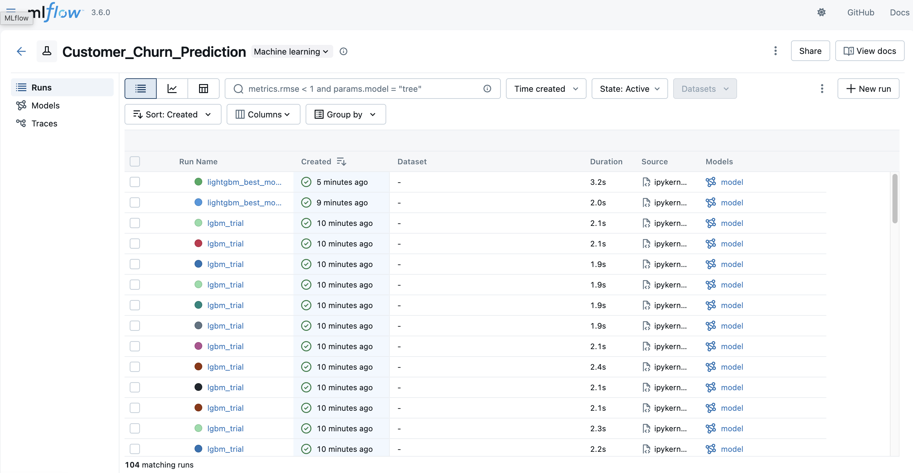
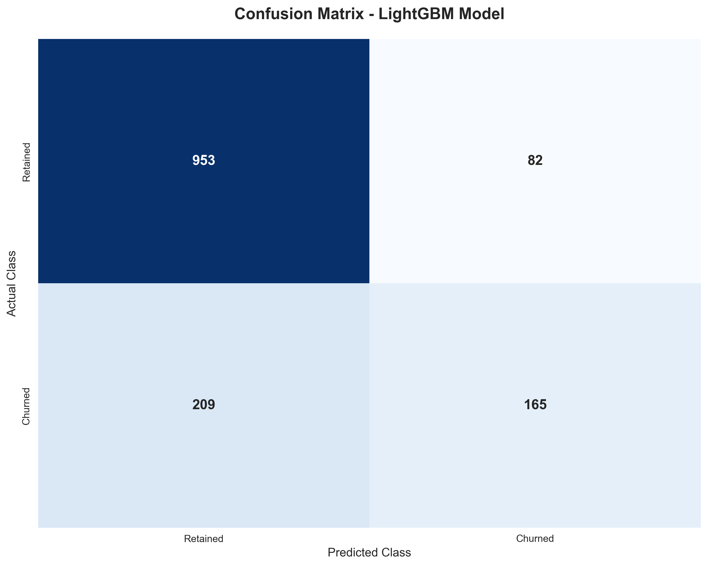
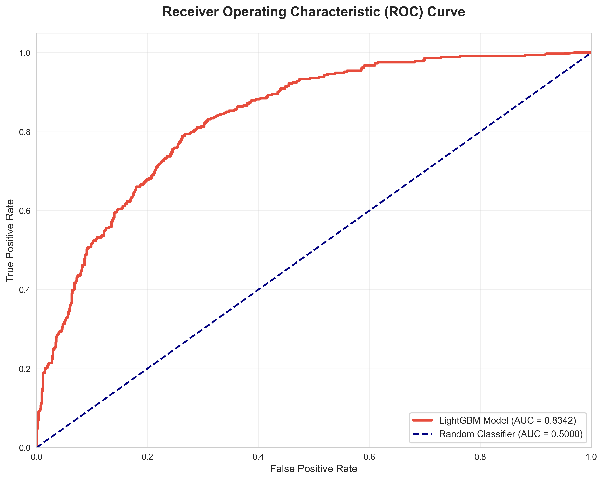

# MLOps Lab 5: Customer Churn Prediction with MLflow

A comprehensive machine learning operations (MLOps) project demonstrating end-to-end customer churn prediction for telecommunications companies using MLflow for experiment tracking, model management, and deployment.



## 📋 Project Overview

This project implements a complete MLOps pipeline for predicting customer churn using the Telco Customer Churn dataset. It showcases industry best practices for experiment tracking, hyperparameter optimization, model versioning, and deployment using MLflow and modern machine learning frameworks.

### Key Features

- **Comprehensive Data Analysis**: Exploratory data analysis with statistical insights and visualization
- **Multiple Model Comparison**: Baseline (Logistic Regression) vs. Advanced (LightGBM) models
- **Automated Hyperparameter Tuning**: Bayesian optimization using Hyperopt (30 trials)
- **MLflow Integration**: Complete experiment tracking with SQLite backend
- **Model Registry**: Version management and production deployment workflows

## 🗂️ Project Structure
```
MLOps-Lab5/
├── .venv/                          # Virtual environment (not tracked in git)
├── assets/                         # Generated visualizations and screenshots
│   ├── confusion_matrix.png        # Model confusion matrix
│   ├── feature_importance.png      # Top feature importance chart
│   ├── mlflow-ui.png              # MLflow UI screenshot
│   └── roc_curve.png              # ROC curve visualization
├── mlruns/                         # MLflow artifacts directory (not tracked in git)
├── customer_churn_mlflow_local.ipynb  # Main Jupyter notebook
├── mlflow.db                       # SQLite database for MLflow tracking
├── requirements.txt                # Python dependencies
├── .gitignore                      # Git ignore rules
├── LICENSE                         # Project license
└── README.md                       # This file
```

## 🚀 Quick Start

### Prerequisites

- Python 3.8 or higher
- pip package manager
- 500 MB free disk space

### Installation

1. **Clone the repository**
```bash
   git clone <repository-url>
   cd MLOps-Lab5
```

2. **Create and activate virtual environment**

```bash
   python3 -m venv .venv
   source .venv/bin/activate
```

3. **Install dependencies**
```bash
   pip install -r requirements.txt
```

4. **Launch Jupyter Notebook**
```bash
   jupyter notebook
```

5. **Open the notebook**
   - Navigate to `customer_churn_mlflow_local.ipynb`
   - Execute cells sequentially from top to bottom

## 📊 Model Performance

### Baseline Model (Logistic Regression)
- Accuracy: ~80%
- Precision: ~65%
- Recall: ~55%
- AUC-ROC: ~0.84

### Advanced Model (LightGBM - Optimized)
- Accuracy: ~81%
- Precision: ~68%
- Recall: ~58%
- AUC-ROC: ~0.86





## 🔬 MLflow Experiment Tracking

### Viewing Experiments

1. **Start the MLflow UI**
```bash
   mlflow ui --backend-store-uri sqlite:///mlflow.db --port 5000
```

2. **Access the UI**
   - Open your browser and navigate to `http://localhost:5000`
   - Select "Customer_Churn_Prediction" experiment from the sidebar
   - View all runs, compare metrics, and analyze model performance

### What's Tracked

- **Parameters**: All hyperparameters for each model
- **Metrics**: Accuracy, Precision, Recall, F1-Score, AUC-ROC
- **Artifacts**: Trained models, visualizations, metadata
- **Tags**: Model type, stage, experiment phase

## 📈 Key Insights

### Top Predictive Features


1. **Contract Type**: Month-to-month contracts show highest churn risk
2. **Tenure**: Customers with <12 months tenure are more likely to churn
3. **Monthly Charges**: Higher charges correlate with increased churn
4. **Internet Service**: Fiber optic customers show elevated churn rates
5. **Tech Support**: Lack of tech support increases churn probability

## 🛠️ Technologies Used

- **Python 3.9+**: Core programming language
- **MLflow 2.9.2**: Experiment tracking and model registry
- **LightGBM 4.1.0**: Gradient boosting framework
- **Scikit-learn 1.3.2**: Machine learning utilities
- **Hyperopt 0.2.7**: Bayesian hyperparameter optimization
- **Pandas 2.1.4**: Data manipulation
- **Matplotlib/Seaborn**: Data visualization
- **SQLite**: MLflow backend storage